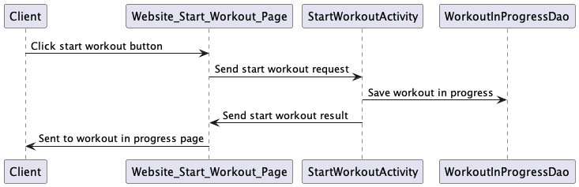

# StrongLifts Clone Design

## 1. Problem Statement

As a weightlifter who uses the 5x5 program, I have trouble keeping track of all my workouts in my journal
and spend too much time calculating my current workout weights, warmup weights,
and deload weights. I would like to digitize all of my workouts that keeps track
of my progress and workouts , when I need to deload, and what my next workouts
will look like. I would also like the application to calculate my warmup weights,
deload weights, and rest time between sets.

## 2. Use Cases

U1. As a lifter, I want to be able to enter my starting weights, so I can begin my program.

U2. As a lifter, I want to see which workout I need to do that day, so I don't accidentally do the wrong workout.

U3. As a lifter, I want to see what my working weights are for the day, so I can set the appropriate weights on the bar.

U4. As a lifter, I want to enter how many reps I did for each set, so I can track my progress.

U5. As lifter, I want to be able to keep track of my body weight, so I can see if I'm gaining too much weight or not enough weight.

U6. As a lifter, I want to see my upcoming workouts calculated for the week, so I don't have to caculate each future workout.

U7. As a lifter, I want a timer to start after my set, so I know how long to rest between my sets.

U8. As a lifter, I want to see a recent history of my workouts, so I can see the progress I've made.

U9. As a lifter, I want to know how long my workout was, so I know how long to block out my workout in my calendar.

## 3. Stretch Goals

U1. As a lifter, I want to see a graph of my progress for each lift.

U2. As a lifter, I want to see a full history of my workouts by date.

U3. As a lifter, I want to be able to customize my sets.

U4. As a lifter, I want to my deloads calculated for me when I don't hit 5x5 three workout days in a row.

U5. As a lifter, I want to see what my warmup weights are for each exercise.

## 4. Design UML

[class-diagram.puml](class-diagram.puml)

## 5. Tables

User Table:
- Id : Partition Key : String
- UserName : Attribute : String
- Weight : Attribute : double
- Deadlift : Attribute  : int
- Squat : Attribute : int
- Bench : Attribute : int
- OHP : Attribute : int
- Row : Attribute : int

Workout Table:
- UserId : Partition Key : String
- Date : Sort Key : Datetime
- WorkoutType : Attribute : enum
- TimeStarted : Attribute : TimeStamp
- TimeEnded : Attribute : TimeStamp
- SquatReps : Attribute : int[]
- BenchReps : Attribute : int[]
- OHPReps : Attribute : int[]
- RowReps : Attribute : int[]
- DeadliftReps : Attribute : int[]
- isComplete : Attribute : boolean

Workout GSI Table:
- UserId : Partition Key : String
- isComplete : Sort Key : boolean
- Include All

## 6. API

### 6.1 Add Reps To Set Endpoint
- Accepts `PUT` requests to /workout/:userId
- Accepts data to update a `workout` including the number of reps, the exercise, and the user ID associated with the workout. Returns the corresponding `workout`.

### 6.2 Get Upcoming Workouts Endpoint
- Accepts `GET` requests to /workout/:userId
- Accepts a user ID and returns the corresponding Workouts.

### 6.3 Start Workout Endpoint
- Accepts `POST` requests to /workout
- Accepts data to create a new `workout` with a provided userID and returns a new `workout`.

### 6.4 End Workout Endpoint
- Accepts `PUT` requests to /workout/:userid
- Accepts data to update a `workout` including a signal of completion and returns the corresponding `workout`.

### 6.5 Get Workout History Endpoint
- Accepts `GET` requests to /workout/:userId
- Accepts a user ID and returns the corresponding workouts

### 6.6 Create Profile Endpoint
- Accepts `POST` requests to /user
- Accepts data to create a new user, with a provided ID, name, body weight, and exercise weight and returns a new User.

## 7. Mockup

[Wireframe](https://www.figma.com/file/6ZHznRBsEo8gSSDoWypMTa/Capstone-Wireframe?node-id=3%3A200&t=90GwY0CNq8sfmf5y-1)