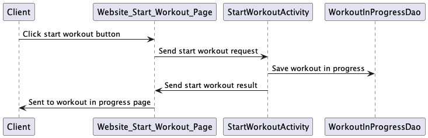

# StrongLifts Clone Design

## 1. Problem Statement

As a weightlifter who uses the 5x5 program, I have trouble keeping track of all my workouts in my journal
and spend too much time calculating my current workout weights, warmup weights, 
and deload weights. I would like to digitize all of my workouts that keeps track 
of my progress and workouts , when I need to deload, and what my next workouts 
will look like. I would also like the application to calculate my warmup weights,
deload weights, and rest time between sets.

## 2. Use Cases

U1. As a lifter, I want to enter how many reps I did for each set.

U2. As a lifter, I want to see what my working weights are for the day.

U3. As a lifter, I want to see which workout I need to do that day.

U4. As a lifter, I want a timer to start after my set, so I know how long to rest between my sets.

U4. As a lifter, I want to see a recent history of my workouts.

U5. As a lifter, I want to see my upcoming workouts calculated for the week.

U6. As lifter, I want to be able to keep track of my body weight.

U7. As a lifter, I want to be able to enter my starting weights.

U8. As a lifter, I want to be able to log the weights for all of my lifts.

U9. As a lifter, I want to know how long my workout was.

## 3. Stretch Goals

U1. As a lifter, I want to see a graph of my progress for each lift.

U2. As a lifter, I want to see a full history of my workouts by date.

U3. As a lifter, I want to be able to customize my sets.

U4. As a lifter, I want to my deloads calculated for me when I don't hit 5x5 three workout days in a row.

U5. As a lifter, I want to see what my warmup weights are for each exercise.

## 4. Design UML

[class-diagram.puml](class-diagram.puml)

## 5. Tables

User Table:
- UserId : Partition Key
- UserName : Attribute
- Weight : Attribute

Lift Log Table:
- UserId : Partition Key
- Deadlift : Attribute
- Squat : Attribute
- Bench : Attribute
- OHP : Attribute
- Row : Attribute

Workout Table:
- UserId : Partition Key
- WorkoutId : Sort Key
- WorkoutType : Attribute
- Date : Attribute
- TimeStarted : Attribute
- TimeEnded : Attribute
- SquatReps : Attribute
- BenchReps : Attribute
- OHPReps : Attribute
- RowReps : Attribute
- DeadliftReps : Attribute

Workout GSI Table:
- UserId : Partition Key
- Date : Sort Key
- Include All

Workout In Progress Table:
- WorkoutInProgressId : Partition Key
- UserId : Sort Key
- WorkoutType : Attribute
- Date : Attribute
- TimeStarted : Attribute
- TimeEnded : Attribute
- SquatReps : Attribute
- BenchReps : Attribute
- OHPReps : Attribute
- RowReps : Attribute
- DeadliftReps : Attribute
- isCompleted : Attribute

## 6. API

### 6.1 Add Reps To Set Endpoint
- Accepts `PUT` requests to /workoutinprogress/:id
- Accepts data to update a `workoutinprogress` including the number of reps, the exercise, and the ID associated with the workout.

### 6.2 Get Upcoming Workouts Endpoint
- Accepts `GET` requests to /workout/:id
- Accepts a user ID and returns the corresponding Workouts

### 6.3 Start Workout Endpoint
- Accepts `POST` requests to /workoutinprogress
- Accepts data to create a new `workoutinprogress` with a given `workoutinprogress` ID

### 6.4 End Workout Endpoint
- Accepts `PUT` requests to /workoutinprogress/:id
- Accepts data to update a 'workoutinprogress' including a signal of completion

### 6.5 Get Workout History Endpoint
- Accepts `GET` requests to /workout/:id
- Accepts a user ID and returns the corresponding workouts

### 6.6 Create Profile Endpoint
- Accepts `POST` requests to /user
- Accepts data to create a new user and lift log, with a provided ID, name, body weight, and exercise weight

## 7. Mockup

[Wireframe](https://www.figma.com/file/6ZHznRBsEo8gSSDoWypMTa/Capstone-Wireframe?node-id=3%3A200&t=90GwY0CNq8sfmf5y-1)